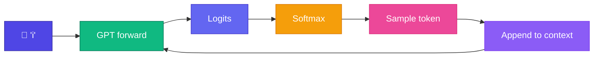

# Generate Text

<ConceptAnim slug="part-09-mini-gpt/03-generate" />

Train হয়ে গেছে — এখন সেই model দিয়ে **text generate** করব। Module 0 থেকেই যে idea শুনে আসছ: একটা token predict করো → context-এ যোগ করো → আবার predict। এই loop-ই **autoregressive** generation।

<Callout type="idea">
💡 Generation = inference mode — কোনো backward pass নেই; শুধু forward + sample loop। Training-এর মতো weight আপডেট হয় না।
</Callout>



## Generation কীভাবে চলে

Prompt দিয়ে শুরু — তারপর model শেষ token-এর logits দেয়, সেখান থেকে একটা pick হয়, context বাড়ে:

<StepReveal steps={[
  { emoji: "🌱", title: "Prompt", body: "'i' or 'apple is'" },
  { emoji: "🧠", title: "Forward", body: "Full GPT pass → last token logits" },
  { emoji: "🎲", title: "Sample", body: "Pick from probability distribution" },
  { emoji: "🔄", title: "Loop", body: "'i like apple is fruit...'" }
]} />

## Example Outputs

Same prompt, different sample — output আলাদা হতে পারে:

```
Prompt: "i"
→ i like apple is fruit
→ i like mango is fruit
→ i like banana is fruit
```

## Causal Mask During Generation

GPT forward-এ **causal mask** active থাকে — token i শুধু tokens 0..i-1 দেখে। Generation-এ এটা naturally satisfy হয়, কারণ context-এ শুধু past tokensই থাকে। Module 7-এর causal attention মনে আছে তো?

## Interactive Demo

<Playground id="part-09/generate" title="Mini GPT Text Generation" />

## তুমি কী শিখলে?

- Generation = autoregressive forward + sample loop
- পরের token predict করতে শুধু **last token-এর logits** লাগে
- Context window = শেষ `seq_len` tokens — তার বেশি হলে কেটে ফেলা হয়

**পরের lesson:** [Temperature](/docs/part-09-mini-gpt/04-temperature)
