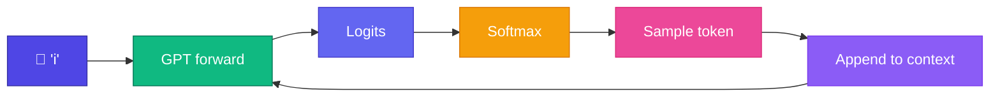

# ✨ Generate Text

Trained Mini GPT ready — এখন **autoregressive generation**: একটা token predict → append → repeat।

<Callout type="idea">
💡 Generation = inference mode — no backward pass, just forward + sample loop।
</Callout>



## Generation Code

```ts
function generate(model: GPT, prompt: string, maxTokens: number): string {
  let ids = tokenize(prompt);
  for (let i = 0; i < maxTokens; i++) {
    const logits = model.forward(ids.slice(-seqLen));
    const nextId = sample(softmax(logits[logits.length - 1]));
    ids.push(nextId);
  }
  return detokenize(ids);
}
```

<StepReveal steps={[
  { emoji: "🌱", title: "Prompt", body: "'i' or 'apple is'" },
  { emoji: "🧠", title: "Forward", body: "Full GPT pass → last token logits" },
  { emoji: "🎲", title: "Sample", body: "Pick from probability distribution" },
  { emoji: "🔄", title: "Loop", body: "'i like apple is fruit...'" }
]} />

## Example Outputs

```
Prompt: "i"
→ i like apple is fruit
→ i like banana is healthy
→ i like mango is fruit
```

<Illustration name="llm-predict" />

## Causal Mask During Generation

GPT forward-এ **causal mask** active — token i শুধু tokens 0..i-1 দেখে। Generation-এ naturally satisfied (শুধু past tokens context-এ)।

## Interactive Demo

<Playground id="part-09/generate" title="Mini GPT Text Generation" />

## ✅ তুমি কী শিখলে?

- Generation = autoregressive forward + sample loop
- Only last token's logits used for next prediction
- Context window = last `seq_len` tokens

**পরের lesson:** [Temperature](/docs/part-09-mini-gpt/04-temperature)
