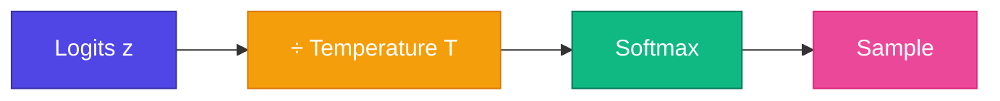

# Temperature

<ConceptAnim slug="part-09-mini-gpt/04-temperature" />

Generate করতে পারছ — কিন্তু output কতটা “নিরাপদ” আর কতটা “creative” হবে? সেটা নিয়ন্ত্রণ করে **Temperature**। Softmax-এর আগে logits-কে T দিয়ে ভাগ করলে distribution বদলে যায়: low T = deterministic, high T = creative (মাঝে মাঝে nonsense-ও)।

<Callout type="idea">
💡 Temperature = creativity knob। T → 0 মানে সবসময় highest probability token; T = 2 মানে distribution flat হয়ে random বেড়ে যায়।
</Callout>

## Formula

$$p_i = \text{softmax}\left(\frac{z_i}{T}\right)$$

| Temperature | Effect | Use case |
|-------------|--------|----------|
| T → 0 | Argmax (deterministic) | Factual answers |
| T = 1 | Default model distribution | Balanced |
| T > 1 | Flatter distribution | Creative writing |

<MathPractical title="গণনা দেখো (ধাপে ধাপে)">
  
১. Logits: <code>z = [2, 1, 0]</code> (তিনটা token-এর raw score)

  
২. <strong>T = 0.5</strong>: <code>z/T = [4, 2, 0]</code> → exp ≈ <code>[54.6, 7.39, 1]</code>, sum ≈ 63.0

  
৩. Softmax (T=0.5): ≈ <code>[0.87, 0.12, 0.02]</code> — খুব peaked, প্রায় সবসময় প্রথম token

  
৪. <strong>T = 2</strong>: <code>z/T = [1, 0.5, 0]</code> → exp ≈ <code>[2.72, 1.65, 1]</code>, sum ≈ 5.37

  
৫. Softmax (T=2): ≈ <code>[0.51, 0.31, 0.19]</code> — flatter, বেশি random / creative

</MathPractical>

## Example

উপরের গণনার same logits: `[2, 1, 0]` for tokens `[apple, banana, mango]`

| T | Probs (approx) | Behavior |
|---|----------------|----------|
| 0.5 | [0.87, 0.12, 0.02] | Very confident → apple |
| 1.0 | [0.67, 0.24, 0.09] | Moderate spread |
| 2.0 | [0.51, 0.31, 0.19] | More random |

<GenerateControls defaultTemperature={1} defaultTopK={5} />

<StepReveal steps={[
  { emoji: "📊", title: "Raw logits", body: "Model output scores" },
  { emoji: "🌡️", title: "Divide by T", body: "Scale before softmax" },
  { emoji: "📈", title: "Softmax", body: "T low → peaked, T high → flat" },
  { emoji: "🎲", title: "Sample", body: "Pick from adjusted distribution" }
]} />

## Interactive Demo

<Playground id="part-09/temperature" title="Temperature Sampling" />

## তুমি কী শিখলে?

- Temperature Softmax-এর আগে logits scale করে
- Low T = greedy / deterministic; high T = random / creative
- T = 1 মানে model-এর natural distribution — কোনো extra twist নেই

**পরের lesson:** [Top-k Sampling](/docs/part-09-mini-gpt/05-top-k)
