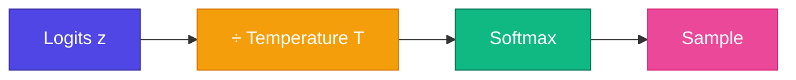

# 🌡️ Temperature

<ConceptAnim slug="part-09-mini-gpt/04-temperature" />

Generation-এ **কতটা random** হবে? **Temperature** parameter logits scale করে — low = deterministic, high = creative (sometimes nonsense)।

<Callout type="idea">
💡 Temperature = creativity knob। T=0 → always pick highest prob. T=2 → very random।
</Callout>

## Formula

$$p_i = \text{softmax}\left(\frac{z_i}{T}\right)$$

| Temperature | Effect | Use case |
|-------------|--------|----------|
| T → 0 | Argmax (deterministic) | Factual answers |
| T = 1 | Default model distribution | Balanced |
| T > 1 | Flatter distribution | Creative writing |

<MathPractical title="গণনা দেখো (ধাপে ধাপে)">
  
১. Logits: <code>z = [2, 1, 0]</code> (তিনটা token-এর raw score)

  
২. <strong>T = 0.5</strong>: <code>z/T = [4, 2, 0]</code> → exp ≈ <code>[54.6, 7.39, 1]</code>, sum ≈ 63.0

  
৩. Softmax (T=0.5): ≈ <code>[0.87, 0.12, 0.02]</code> — খুব peaked, প্রায় সবসময় প্রথম token

  
৪. <strong>T = 2</strong>: <code>z/T = [1, 0.5, 0]</code> → exp ≈ <code>[2.72, 1.65, 1]</code>, sum ≈ 5.37

  
৫. Softmax (T=2): ≈ <code>[0.51, 0.31, 0.19]</code> — flatter, বেশি random / creative

</MathPractical>

## Example

Logits: `[2.0, 1.0, 0.5]` for tokens `[apple, banana, mango]`

| T | Probs (approx) | Behavior |
|---|----------------|----------|
| 0.5 | [0.84, 0.11, 0.04] | Very confident → apple |
| 1.0 | [0.63, 0.23, 0.14] | Moderate spread |
| 2.0 | [0.48, 0.29, 0.23] | More random |

<GenerateControls defaultTemperature={1} defaultTopK={5} />

<StepReveal steps={[
  { emoji: "📊", title: "Raw logits", body: "Model output scores" },
  { emoji: "🌡️", title: "Divide by T", body: "Scale before softmax" },
  { emoji: "📈", title: "Softmax", body: "T low → peaked, T high → flat" },
  { emoji: "🎲", title: "Sample", body: "Pick from adjusted distribution" }
]} />

## Interactive Demo

<Playground id="part-09/temperature" title="Temperature Sampling" />

## ✅ তুমি কী শিখলে?

- Temperature scales logits before softmax
- Low T = greedy/deterministic, high T = random
- T=1 = model's natural distribution

**পরের lesson:** [Top-k Sampling](/docs/part-09-mini-gpt/05-top-k)
