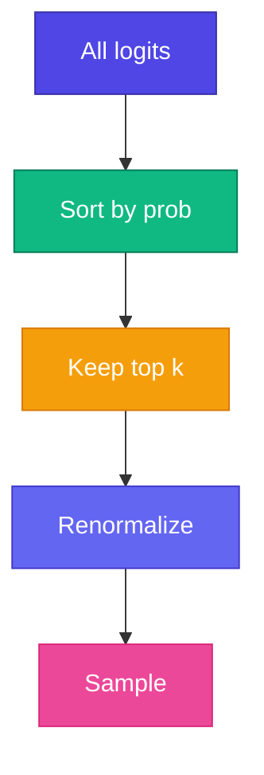

# Top-k Sampling

<ConceptAnim slug="part-09-mini-gpt/05-top-k" />

Temperature বাড়ালে creativity আসে — কিন্তু vocabulary-র কোনো low-probability nonsense token-ও pick হয়ে যেতে পারে। **Top-k** সেই সমস্যা ধরে: শুধু **kটা highest-probability** token রাখে, বাকি কেটে ফেলে। Quality আর diversity-র মধ্যে balance পাওয়া যায়।

<Callout type="tip">
✅ Production LLM-এ Temperature + Top-k (বা Top-p) **একসাথে** ব্যবহার হয় — ChatGPT-ও same idea। একটা randomness দেয়, অন্যটা safety net।
</Callout>

## Algorithm কীভাবে চলে

Softmax → top-k filter → renormalize → sample — নীচের Playground-এ `k` বদলে candidate set দেখো।

## উদাহরণ

Probs: `apple=0.4, banana=0.25, mango=0.15, grape=0.1, ...`

| k | Candidates | Effect |
|---|------------|--------|
| k=1 | apple only | = argmax |
| k=3 | apple, banana, mango | Reasonable variety |
| k=10 | All tokens | No filtering |

<StepReveal steps={[
  { emoji: "📊", title: "Softmax probs", body: "পুরো vocabulary-র distribution" },
  { emoji: "🔝", title: "Top-k filter", body: "শুধু kটা highest রাখো" },
  { emoji: "📐", title: "Renormalize", body: "Filter করা probs-এর sum = 1" },
  { emoji: "🎲", title: "Sample", body: "Pick from k candidates" }
]} />

## Top-k vs Top-p (nucleus) — তফাত

| Method | Filter by |
|--------|-----------|
| **Top-k** | Fixed count k |
| Top-p | Cumulative probability p |

Top-k simpler — আমাদের Mini GPT-এ Top-k ব্যবহার করি। Top-p (nucleus sampling) পরে nanoGPT বা production code পড়তে গেলে দেখবে।

<GenerateControls defaultTemperature={0.8} defaultTopK={3} />

## নিজে চেষ্টা করো

<Playground id="part-09/top-k" title="Top-k Sampling" />

## তুমি কী শিখলে?

- Top-k শুধু kটা best token থেকে sample নেয়
- Low-probability nonsense token আটকে দেয়
- Temperature-এর সাথে combine করলে best result — Module 9 শেষ!

**পরের Module:** [Module 10 — Production Bridge](/docs/part-10-bridge)
