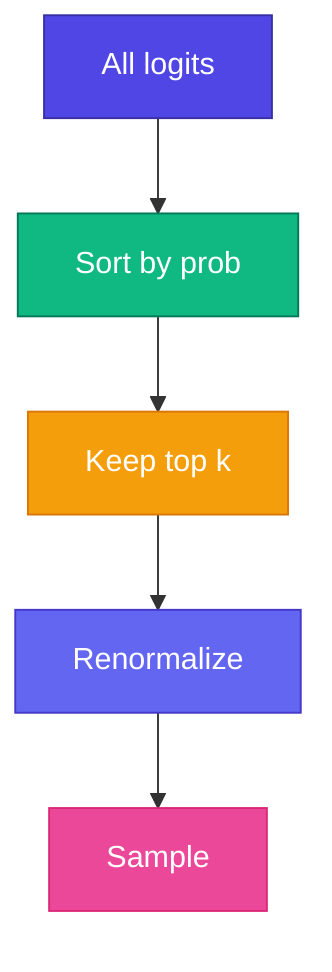

# 🎯 Top-k Sampling

High temperature-এ model nonsense token pick করতে পারে। **Top-k** restricts sampling to **k highest-probability** tokens only — quality + diversity balance।

<Callout type="tip">
✅ Production LLM-এ temperature + top-k (or top-p) **combined** use হয় — ChatGPT-ও same idea।
</Callout>



## Algorithm

```ts
function topKSample(logits: number[], k: number, T: number): number {
  const probs = softmax(logits.map(z => z / T));
  const topK = getTopKIndices(probs, k);
  const filtered = topK.map(i => probs[i]);
  const renorm = normalize(filtered);
  return topK[sample(renorm)];
}
```

## Example

Probs: `apple=0.4, banana=0.25, mango=0.15, grape=0.1, ...`

| k | Candidates | Effect |
|---|------------|--------|
| k=1 | apple only | = argmax |
| k=3 | apple, banana, mango | Reasonable variety |
| k=10 | All tokens | No filtering |

<StepReveal steps={[
  { emoji: "📊", title: "Softmax probs", body: "Full vocabulary distribution" },
  { emoji: "🔝", title: "Top-k filter", body: "Keep only k highest" },
  { emoji: "📐", title: "Renormalize", body: "Filtered probs sum to 1" },
  { emoji: "🎲", title: "Sample", body: "Pick from k candidates" }
]} />

## Top-k vs Top-p (nucleus)

| Method | Filter by |
|--------|-----------|
| **Top-k** | Fixed count k |
| Top-p | Cumulative probability p |

Top-k simpler — আমাদের Mini GPT-এ top-k use করি।

<GenerateControls defaultTemperature={0.8} defaultTopK={3} />

## Interactive Demo

<Playground id="part-09/top-k" title="Top-k Sampling" />

## ✅ তুমি কী শিখলে?

- Top-k limits sampling to k best tokens
- Prevents low-probability nonsense tokens
- Combine with temperature for best results

**পরের Module:** [Module 10 — Production Bridge](/docs/part-10-bridge)
