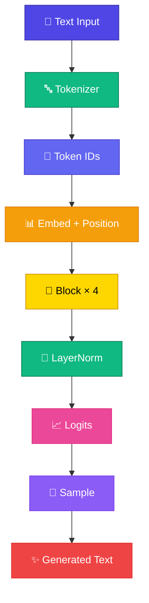

# Module 9 — Mini GPT

এতদিনে Tokenizer থেকে Attention, আর Attention থেকে Transformer Block পর্যন্ত এসেছ। এখন সেগুলো জোড়া লাগিয়ে একটা **সম্পূর্ণ Mini GPT** বানাব — Karpathy-এর nanoGPT-এর মতো architecture, কিন্তু TypeScript-এ, কোনো ML library ছাড়াই।

<Callout type="idea">
💡 প্রায় **৫০০ লাইন** TypeScript — browser-এই train আর generate। এটাই course-এর **final working LLM**।
</Callout>

## এই Module-এ কী শিখবে?

| # | Lesson | Topic |
|---|--------|-------|
| 9.1 | [GPT Architecture](/docs/part-09-mini-gpt/01-gpt-architecture) | পুরো stack এক নজরে |
| 9.2 | [Train Mini GPT](/docs/part-09-mini-gpt/02-train) | ~৫০০-লাইন training |
| 9.3 | [Generate Text](/docs/part-09-mini-gpt/03-generate) | Autoregressive loop |
| 9.4 | [Temperature](/docs/part-09-mini-gpt/04-temperature) | Randomness control |
| 9.5 | [Top-k Sampling](/docs/part-09-mini-gpt/05-top-k) | Token choice সীমিত করা |

প্রথমে architecture দেখব, তারপর train করব, তারপর text generate করব — শেষে Temperature আর Top-k দিয়ে output-এর “ব্যক্তিত্ব” নিয়ন্ত্রণ করব।

**আগের Module:** [Module 8 — Transformer Block](/docs/part-08-transformer)

**পরের step:** [GPT Architecture](/docs/part-09-mini-gpt/01-gpt-architecture)
