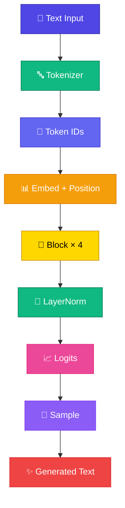

# Module 9 — Mini GPT

Module 1-8-এর সব piece একসাথে — **সম্পূর্ণ Mini GPT**। Karpathy-এর nanoGPT-এর মতো, কিন্তু TypeScript-এ, zero ML library।

<Callout type="idea">
💡 ~500 lines TypeScript — browser-এ train + generate। এটাই course-এর **final working LLM**।
</Callout>

## Lessons

| # | Lesson | Topic |
|---|--------|-------|
| 9.1 | [GPT Architecture](/docs/part-09-mini-gpt/01-gpt-architecture) | Full stack overview |
| 9.2 | [Train Mini GPT](/docs/part-09-mini-gpt/02-train) | ~500-line training |
| 9.3 | [Generate Text](/docs/part-09-mini-gpt/03-generate) | Autoregressive loop |
| 9.4 | [Temperature](/docs/part-09-mini-gpt/04-temperature) | Randomness control |
| 9.5 | [Top-k Sampling](/docs/part-09-mini-gpt/05-top-k) | Restrict token choices |

**আগের Module:** [Module 8 — Transformer Block](/docs/part-08-transformer)

**পরের step:** [GPT Architecture](/docs/part-09-mini-gpt/01-gpt-architecture)
