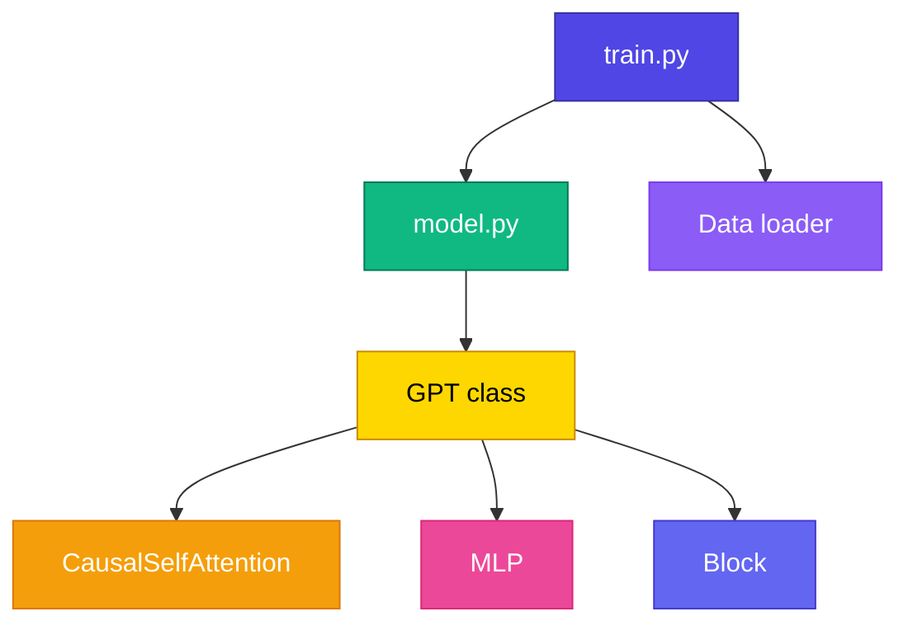

# 📖 Reading nanoGPT

<ConceptAnim slug="part-10-bridge/01-reading-nanogpt" />

তুমি Mini GPT বানিয়েছো — এখন Andrej Karpathy-এর [**nanoGPT**](https://github.com/karpathy/nanoGPT) পড়ো। Same architecture, production-quality Python/PyTorch code.

<Callout type="tip">
✅ nanoGPT ~300 lines — minimal, readable, educational। Course-এর সব concept এখানে live দেখবে।
</Callout>



## File Map

| File | What to read | Maps to Module |
|------|-------------|----------------|
| `model.py` → `GPT` | Main model class | 9.1 |
| `model.py` → `CausalSelfAttention` | Masked self-attention | 7.3–7.5 |
| `model.py` → `Block` | Norm→Attn→Res→FFN | 8.5 |
| `model.py` → `MLP` | Feed-forward | 8.3 |
| `train.py` | Training loop | 9.2 |
| `sample.py` | Generation | 9.3 |

## Reading Order

<StepReveal steps={[
  { emoji: "1️⃣", title: "CausalSelfAttention", body: "Line ~70 — compare Module 7 formula" },
  { emoji: "2️⃣", title: "Block", body: "Pre-LN + residual — Module 8" },
  { emoji: "3️⃣", title: "GPT.__init__", body: "Embeddings + n_layer blocks" },
  { emoji: "4️⃣", title: "GPT.forward", body: "Token+pos embed → blocks → lm_head" },
  { emoji: "5️⃣", title: "train.py", body: "AdamW, cosine LR, gradient accumulation" }
]} />

## Key Differences from Our Mini GPT

| Feature | Our Mini GPT | nanoGPT |
|---------|-------------|---------|
| Autograd | Custom (Module 4) | PyTorch |
| Optimizer | SGD/Adam simple | AdamW + weight decay |
| LR schedule | Fixed | Cosine decay |
| Data | Fruit (~30 words) | Shakespeare / OpenWebText |
| Params | ~270K | 10M–124M+ |

## CausalSelfAttention — Side by Side

**Our code (Module 7):**
<CodeRun title="Self-attention (our TS)" height={160} editable={false} autoRun={false}>{`const scores = matmul(Q, transpose(K)) / Math.sqrt(d_k);
const weights = causalSoftmax(scores);  // mask future
const output = matmul(weights, V);
console.log('Attention output shape:', output.length);`}</CodeRun>

**nanoGPT (model.py):**
```python
att = (q @ k.transpose(-2, -1)) * (1.0 / math.sqrt(k.size(-1)))
att = att.masked_fill(self.bias[:,:,:T,:T] == 0, float('-inf'))
att = F.softmax(att, dim=-1)
y = att @ v
```

Same formula — different syntax!

## Exercise Checklist

- [ ] Clone nanoGPT: `git clone https://github.com/karpathy/nanoGPT`
- [ ] Read `model.py` top to bottom — mark sections you recognize
- [ ] Run `python train.py config/train_shakespeare_char.py` on GPU
- [ ] Compare loss curve with our Mini GPT training
- [ ] Read `sample.py` — find temperature implementation

<Callout type="warn">
⚠️ nanoGPT GPU চায় training-এর জন্য — CPU-তে character-level Shakespeare slow but works।
</Callout>

## Further Reading

| Resource | Why |
|----------|-----|
| [Let's build GPT](https://www.youtube.com/watch?v=kCc8FmEb1nY) | Karpathy video — matches this course |
| [micrograd](https://github.com/karpathy/micrograd) | Autograd engine (Module 4 reference) |
| [makemore](https://github.com/karpathy/makemore) | Bigram → MLP → Transformer journey |

## ✅ তুমি কী শিখলে?

- nanoGPT = same GPT architecture in PyTorch
- Every Module 6–9 concept maps to nanoGPT code
- Ready to read production LLM implementations

**পরের lesson:** [What's Next](/docs/part-10-bridge/02-whats-next)
