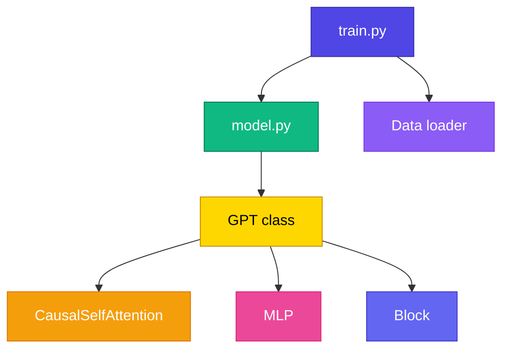

# Reading nanoGPT

<ConceptAnim slug="part-10-bridge/01-reading-nanogpt" />

Mini GPT বানিয়েছো — এখন Andrej Karpathy-এর [**nanoGPT**](https://github.com/karpathy/nanoGPT) খুলে পড়ো। Architecture same; শুধু production-quality Python/PyTorch। Course-এর Module 6–9-এর প্রতিটা concept এখানে live দেখবে।

<Callout type="tip">
✅ nanoGPT প্রায় **৩০০ লাইন** — minimal, readable, educational। “বড় codebase” ভয় পাওয়ার কিছু নেই; তুমি already জানো কী খুঁজতে হবে।
</Callout>



## File Map — কোন ফাইল কী করে

কোন file কোন Module-এর সাথে মিলে যায়:

| File | What to read | Maps to Module |
|------|-------------|----------------|
| `model.py` → `GPT` | Main model class | 9.1 |
| `model.py` → `CausalSelfAttention` | Masked self-attention | 7.3–7.5 |
| `model.py` → `Block` | Norm→Attn→Res→FFN | 8.5 |
| `model.py` → `MLP` | Feed-forward | 8.3 |
| `train.py` | Training loop | 9.2 |
| `sample.py` | Generation | 9.3 |

## পড়ার Order

এই ক্রমে পড়লে হারিয়ে যাবে না:

<StepReveal steps={[
  { emoji: "1️⃣", title: "CausalSelfAttention", body: "Line ~70 — compare Module 7 formula" },
  { emoji: "2️⃣", title: "Block", body: "Pre-LN + residual — Module 8" },
  { emoji: "3️⃣", title: "GPT.__init__", body: "Embeddings + n_layer blocks" },
  { emoji: "4️⃣", title: "GPT.forward", body: "Token+pos embed → blocks → lm_head" },
  { emoji: "5️⃣", title: "train.py", body: "AdamW, cosine LR, gradient accumulation" }
]} />

## আমাদের Mini GPT থেকে পার্থক্য

| Feature | Our Mini GPT | nanoGPT |
|---------|-------------|---------|
| Autograd | Custom (Module 4) | PyTorch |
| Optimizer | SGD/Adam simple | AdamW + weight decay |
| LR schedule | Fixed | Cosine decay |
| Data | Fruit (~30 words) | Shakespeare / OpenWebText |
| Params | ~270K | 10M–124M+ |

## CausalSelfAttention — পাশাপাশি

**Our code (Module 7):**
<CodeRun title="Self-attention (our TS)" height={320} editable={false}>{`// Causal self-attention — same formula as nanoGPT, fully runnable
const d_k = 2;
const Q = [[1, 0], [0, 1], [1, 1]]; // 3 tokens
const K = [[1, 0], [0, 1], [1, 1]];
const V = [[1, 0], [0, 1], [0.5, 0.5]];

const transpose = (M: number[][]) => M[0].map((_, j) => M.map((r) => r[j]));
const matmul = (A: number[][], B: number[][]) =>
  A.map((row) => transpose(B).map((col) => row.reduce((s, v, k) => s + v * col[k], 0)));

// softmax each row, masking future tokens (j > i)
function causalSoftmax(scores: number[][]): number[][] {
  return scores.map((row, i) => {
    const masked = row.map((v, j) => (j > i ? -Infinity : v));
    const max = Math.max(...masked);
    const exp = masked.map((v) => Math.exp(v - max));
    const sum = exp.reduce((a, b) => a + b, 0);
    return exp.map((e) => e / sum);
  });
}

const scale = Math.sqrt(d_k);
const scores = matmul(Q, transpose(K)).map((row) => row.map((v) => v / scale));
const weights = causalSoftmax(scores); // mask future
const output = matmul(weights, V);

log.step('Causal Self-Attention');
log.data('weights (row i attends to <= i)', weights.map((r) => r.map((v) => Number(v.toFixed(2)))));
log.data('output', output.map((r) => r.map((v) => Number(v.toFixed(2)))));
log.data('output shape', output.length + ' x ' + output[0].length);
log.ok('same softmax(QK^T / sqrt(d_k)) . V — now with causal mask');`}</CodeRun>

**nanoGPT (model.py):**
```python
att = (q @ k.transpose(-2, -1)) * (1.0 / math.sqrt(k.size(-1)))
att = att.masked_fill(self.bias[:,:,:T,:T] == 0, float('-inf'))
att = F.softmax(att, dim=-1)
y = att @ v
```

Same formula — শুধু syntax আলাদা। TypeScript vs PyTorch; গণিত একই।

## Exercise Checklist

- [ ] Clone nanoGPT: `git clone https://github.com/karpathy/nanoGPT`
- [ ] Read `model.py` top to bottom — mark sections you recognize
- [ ] Run `python train.py config/train_shakespeare_char.py` on GPU
- [ ] Compare loss curve with our Mini GPT training
- [ ] Read `sample.py` — find temperature implementation

<Callout type="warn">
⚠️ nanoGPT training-এর জন্য GPU চাই — CPU-তে character-level Shakespeare চলে, কিন্তু slow। প্রথমে code পড়ে map করাই মূল কাজ।
</Callout>

## আরও পড়ো

| Resource | Why |
|----------|-----|
| [Let's build GPT](https://www.youtube.com/watch?v=kCc8FmEb1nY) | Karpathy video — matches this course |
| [micrograd](https://github.com/karpathy/micrograd) | Autograd engine (Module 4 reference) |
| [makemore](https://github.com/karpathy/makemore) | Bigram → MLP → Transformer journey |

## তুমি কী শিখলে?

- nanoGPT = same GPT architecture, PyTorch-এ
- Module 6–9-এর প্রতিটা concept nanoGPT code-এ map হয়
- এখন production LLM codebase পড়ার foundation তৈরি

**পরের lesson:** [What's Next](/docs/part-10-bridge/02-whats-next)
