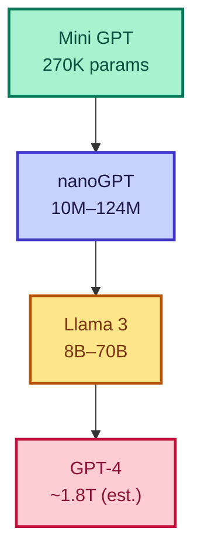
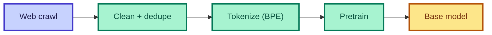
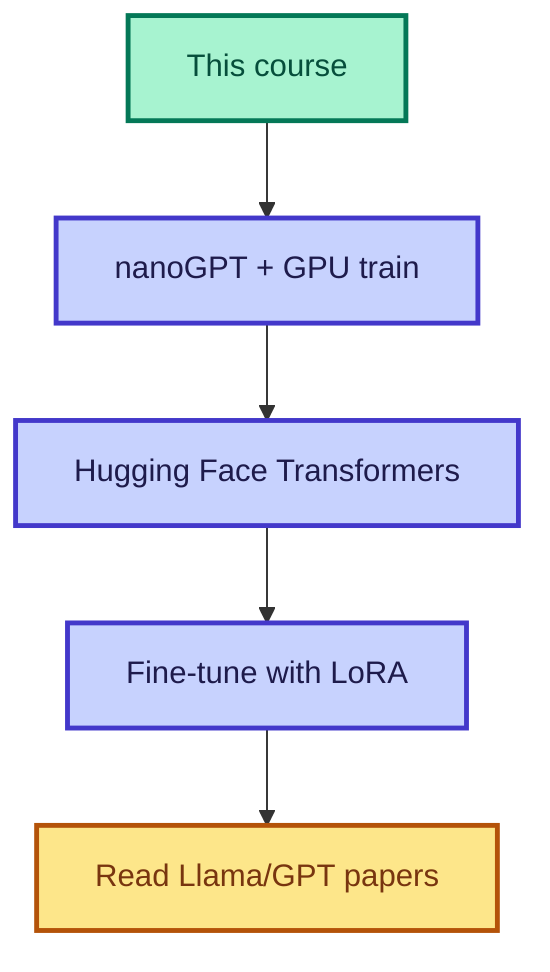

# এর পর কী?

<ConceptAnim slug="part-10-bridge/02-whats-next" />

Mini GPT + nanoGPT পড়ে architecture বুঝে গেছ। Production LLM (GPT-4, Llama, Claude) = **same idea**, শুধু **massive scale** + **massive data** + কিছু engineering trick। নতুন “জাদু” নেই — পরিমাণ আর pipeline বড়।

<Callout type="idea">
💡 GPT-4-এর exact architecture secret — কিন্তু ingredients known: Transformer, scale, data, RLHF। তুমি ingredients বুঝো; recipe follow করতে পারবে।
</Callout>



## Scaling Laws কী বলে

| Factor | Mini GPT | Production |
|--------|----------|------------|
| Parameters | 270K | Billions |
| Data | 30 sentences | Trillions of tokens |
| Compute | Browser CPU | Thousands of GPUs |
| Training time | Minutes | Weeks/months |
| Cost | Free | Millions of $ |

Scale বাড়লেই quality বাড়ে — এই সম্পর্ককেই বলে **scaling laws**। তোমার fruit model আর GPT-4-এর মধ্যে মূল পার্থক্য এখানেই।

<StepReveal steps={[
  { emoji: "📊", title: "Pretraining", body: "Internet-scale data-তে next-token prediction" },
  { emoji: "🎯", title: "Fine-tuning", body: "Task-specific adaptation (SFT)" },
  { emoji: "👍", title: "RLHF", body: "Human feedback → ভালো response" },
  { emoji: "⚡", title: "Inference opt", body: "Quantization, KV-cache, speculative decoding" }
]} />

## Pretraining Pipeline কেমন



Objective course-এর মতোই: **next token-এর cross-entropy minimize** — শুধু data প্রায় 10¹² গুণ বেশি।

## Fine-Tuning-এর রাস্তা

Base model পরে মানুষের কাজে লাগানোর জন্য:

| Method | Data needed | Example |
|--------|-------------|---------|
| **SFT** | Instruction pairs | "Translate to Bangla: ..." |
| **LoRA** | Small adapter weights | Fine-tune 7B on laptop |
| **RLHF** | Human preference rankings | ChatGPT alignment |
| **DPO** | Preference pairs (no RL) | Simpler alignment |

## Architecture-এর বাইরে Engineering

Architecture ছাড়াও production-এ এই trickগুলো দেখবে:

| Technique | Why |
|-----------|-----|
| **Flash Attention** | Memory-efficient attention |
| **Mixed precision (fp16/bf16)** | 2× faster training |
| **Gradient checkpointing** | Trade compute for memory |
| **KV-cache** | Fast autoregressive inference |
| **Quantization (GPTQ, AWQ)** | Run 70B on consumer GPU |

## এগিয়ে যাওয়ার Path



## আরও Resource

| Resource | Focus |
|----------|-------|
| [Hugging Face Course](https://huggingface.co/learn) | Transformers library |
| [LLM Visualization](https://bbycroft.net/llm) | Interactive GPT explorer |
| [The Annotated Transformer](http://nlp.seas.harvard.edu/annotated-transformer/) | Paper + code |
| [llama.cpp](https://github.com/ggerganov/llama.cpp) | C++ inference engine |
| [Axolotl](https://github.com/OpenAccess-AI-Collective/axolotl) | Fine-tuning toolkit |

<Callout type="tip">
✅ **তুমি course শেষ করেছো** — Tokenizer থেকে Transformer Block, Mini GPT পর্যন্ত সব build করেছো। এটা বেশিরভাগ developer-এর চেয়ে বেশি LLM internals knowledge।
</Callout>

## Course Complete — শেষ!

```
Module 0:  Intro ✅
Module 1:  Tokenizer ✅
Module 2:  Bigram LM ✅
Module 3:  Math ✅
Module 4:  Autograd ✅
Module 5:  Neural Net ✅
Module 6:  Neural LM ✅
Module 7:  Attention ✅
Module 8:  Transformer ✅
Module 9:  Mini GPT ✅
Module 10: Bridge ✅
```

## তুমি কী শিখলে?

- Production LLM = একই **Transformer**, শুধু **massive scale** + data + engineering
- Pipeline: **Pretraining → Fine-tuning → align (RLHF)**
- যেকোনো LLM codebase পড়ার foundation এখন তোমার কাছে আছে

**শুরু থেকে:** [Course Home](/docs)
