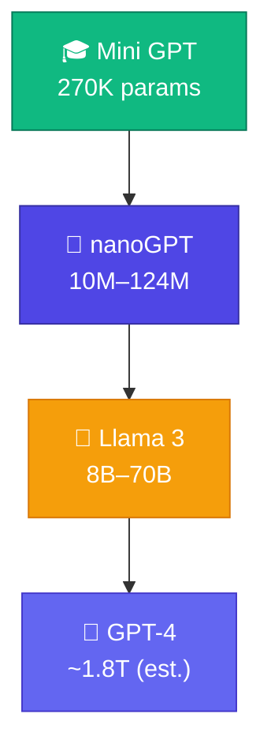
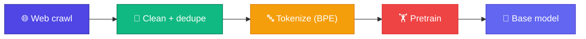
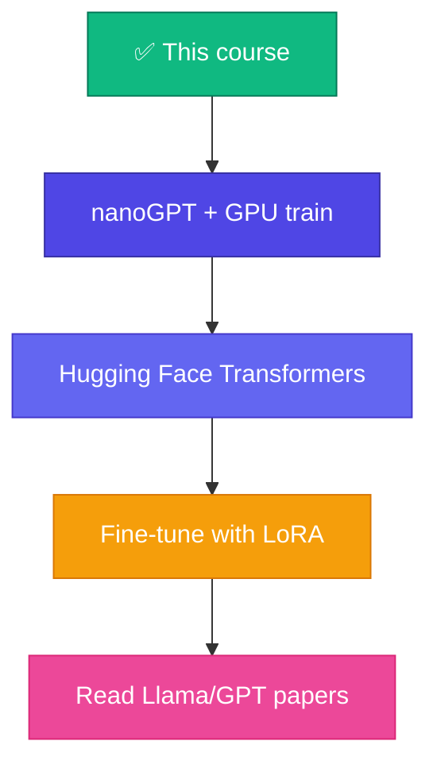

# 🚀 What's Next?

Mini GPT + nanoGPT = **architecture understood**। Production LLM (GPT-4, Llama, Claude) = same idea, **massive scale** + **massive data** + engineering tricks।

<Callout type="idea">
💡 GPT-4 architecture secret — কিন্তু ingredients known: transformer, scale, data, RLHF। তুমি ingredients বুঝো — recipe follow করতে পারবে।
</Callout>



## The Scaling Laws

| Factor | Mini GPT | Production |
|--------|----------|------------|
| Parameters | 270K | Billions |
| Data | 30 sentences | Trillions of tokens |
| Compute | Browser CPU | Thousands of GPUs |
| Training time | Minutes | Weeks/months |
| Cost | Free | Millions of $ |

<StepReveal steps={[
  { emoji: "📊", title: "Pretraining", body: "Next-token prediction on internet-scale data" },
  { emoji: "🎯", title: "Fine-tuning", body: "Task-specific adaptation (SFT)" },
  { emoji: "👍", title: "RLHF", body: "Human feedback → better responses" },
  { emoji: "⚡", title: "Inference opt", body: "Quantization, KV-cache, speculative decoding" }
]} />

## Pretraining Pipeline



Same objective as our course: **minimize cross-entropy on next token** — just 10¹²× more data.

## Fine-Tuning Paths

| Method | Data needed | Example |
|--------|-------------|---------|
| **SFT** | Instruction pairs | "Translate to Bangla: ..." |
| **LoRA** | Small adapter weights | Fine-tune 7B on laptop |
| **RLHF** | Human preference rankings | ChatGPT alignment |
| **DPO** | Preference pairs (no RL) | Simpler alignment |

## Engineering Beyond Architecture

| Technique | Why |
|-----------|-----|
| **Flash Attention** | Memory-efficient attention |
| **Mixed precision (fp16/bf16)** | 2× faster training |
| **Gradient checkpointing** | Trade compute for memory |
| **KV-cache** | Fast autoregressive inference |
| **Quantization (GPTQ, AWQ)** | Run 70B on consumer GPU |

## Your Learning Path Forward



## Recommended Resources

| Resource | Focus |
|----------|-------|
| [Hugging Face Course](https://huggingface.co/learn) | Transformers library |
| [LLM Visualization](https://bbycroft.net/llm) | Interactive GPT explorer |
| [The Annotated Transformer](http://nlp.seas.harvard.edu/annotated-transformer/) | Paper + code |
| [llama.cpp](https://github.com/ggerganov/llama.cpp) | C++ inference engine |
| [Axolotl](https://github.com/OpenAccess-AI-Collective/axolotl) | Fine-tuning toolkit |

<Callout type="tip">
✅ **তুমি course শেষ করেছো** — tokenizer থেকে transformer block পর্যন্ত সব build করেছো। এটা 99% developers-এর চেয়ে বেশি LLM internals knowledge।
</Callout>

## Course Complete! 🎉

```
Module 0:  Intro ✅
Module 1:  Tokenizer ✅
Module 2:  Bigram LM ✅
Module 3:  Math ✅
Module 4:  Autograd ✅
Module 5:  Neural Net ✅
Module 6:  Neural LM ✅
Module 7:  Attention ✅
Module 8:  Transformer ✅
Module 9:  Mini GPT ✅
Module 10: Bridge ✅
```

## ✅ তুমি কী শিখলে?

- Production LLM = same transformer, massive scale
- Pipeline: pretrain → fine-tune → align (RLHF)
- You have the foundation to read any LLM codebase

**শুরু থেকে:** [Course Home](/docs)
